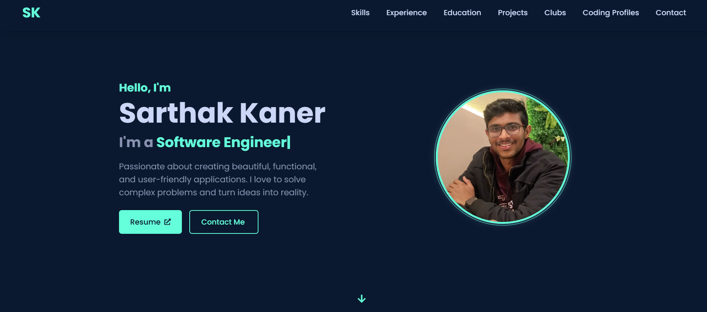

# Sarthak Kaner - Portfolio Website



A modern, interactive portfolio website built with React, Vite, and Framer Motion to showcase my skills, projects, experience, and accomplishments as a software engineer.

## 🚀 Features

- **Sleek UI/UX**: Modern design with smooth animations and transitions powered by Framer Motion
- **Fully Responsive**: Optimized for all device sizes from mobile to desktop
- **Interactive Sections**:
  - Dynamic hero section with typewriter animation
  - Detailed skills showcase with categorized abilities
  - Work experience and education timeline
  - Project showcase with links to GitHub repositories
  - Leadership roles and committee experience
  - Competitive programming profiles with statistics
  - Contact form integrated with FormSubmit

## 🛠️ Built With

- [React](https://reactjs.org/) - UI library
- [Vite](https://vitejs.dev/) - Next-generation frontend tooling
- [Tailwind CSS](https://tailwindcss.com/) - Utility-first CSS framework
- [Framer Motion](https://www.framer.com/motion/) - Animation library
- [React Icons](https://react-icons.github.io/react-icons/) - Icon components
- [React Router](https://reactrouter.com/) - Routing library
- [React Scroll](https://www.npmjs.com/package/react-scroll) - Smooth scrolling navigation
- [React Type Animation](https://www.npmjs.com/package/react-type-animation) - Text typing effects
- [EmailJS](https://www.emailjs.com/) - Email functionality for contact form

## 🚦 Getting Started

### Installation

1. Clone the repository
   ```bash
   git clone https://github.com/SarthakKaner/portfolio-website.git
   cd portfolio-website
   ```

2. Install dependencies
   ```bash
   npm install
   # or
   yarn
   ```

3. Start the development server
   ```bash
   npm run dev
   # or
   yarn dev
   ```

4. Open [http://localhost:5173](http://localhost:5173) in your browser


## 🎨 Customization

- **Colors**: Edit the color scheme in `tailwind.config.js`
- **Content**: Update personal information in the respective component files
- **Styling**: Modify component styles in their respective files or in `index.css`


Designed and developed with ❤️ by [Sarthak Kaner](https://sarthakkaner.netlify.app/)